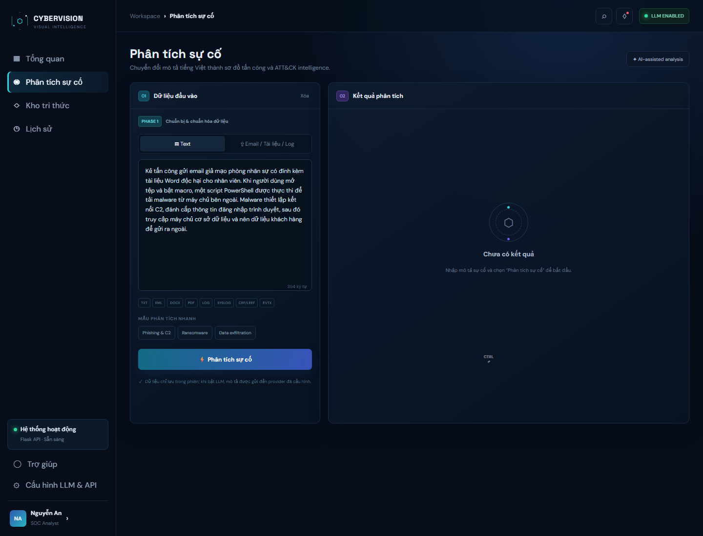
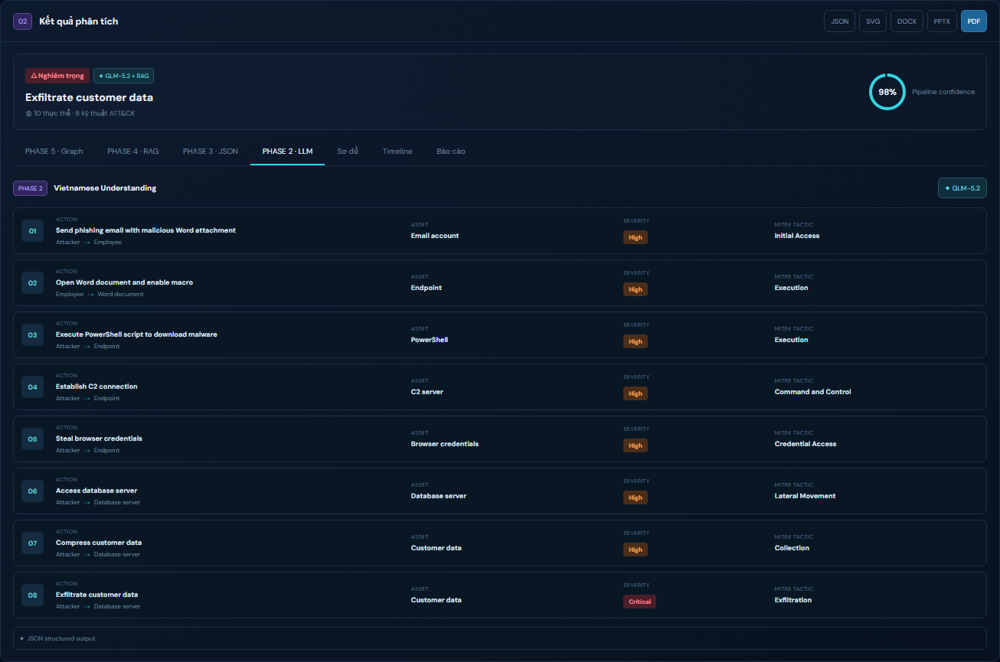
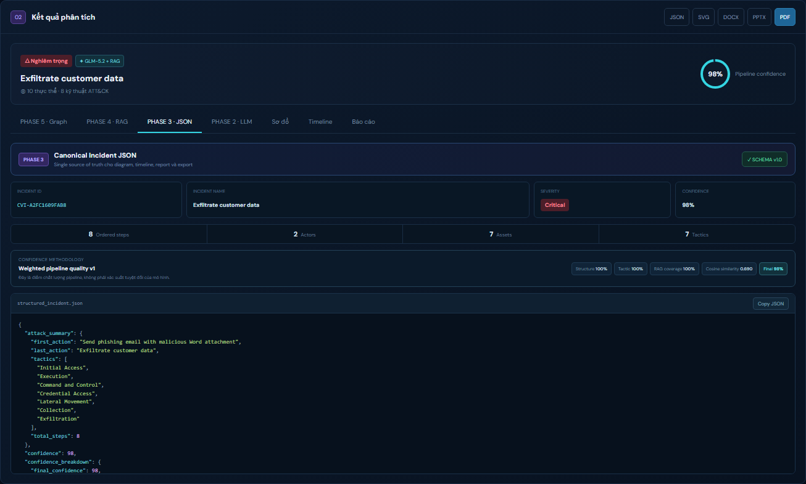
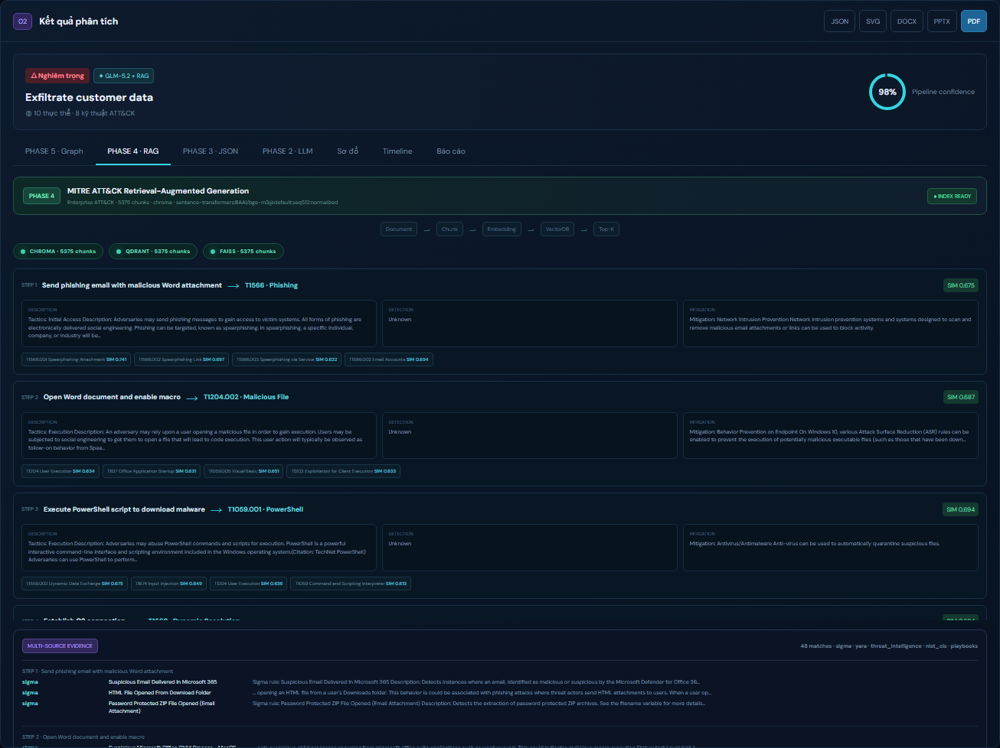
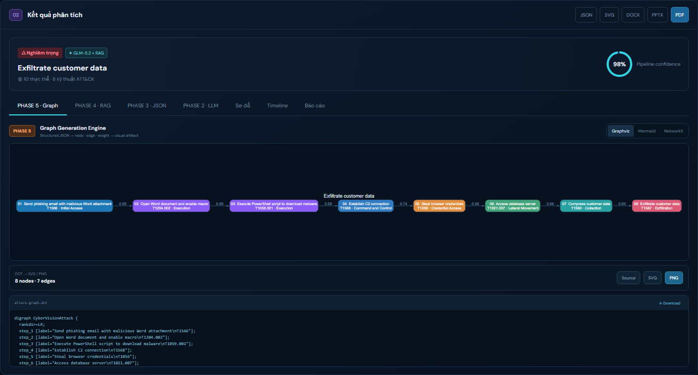
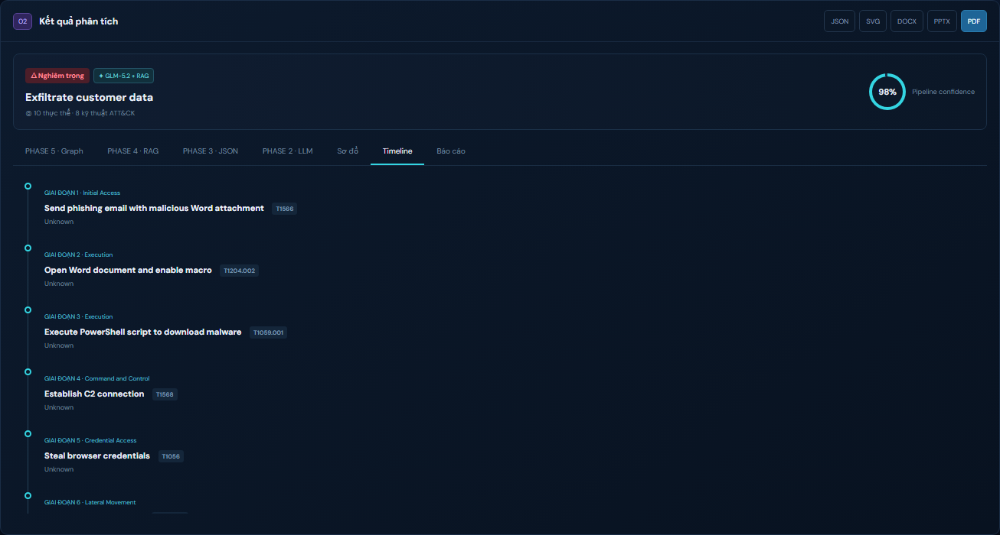
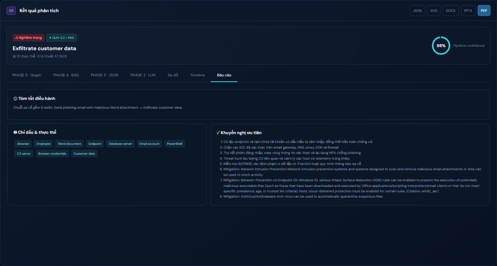
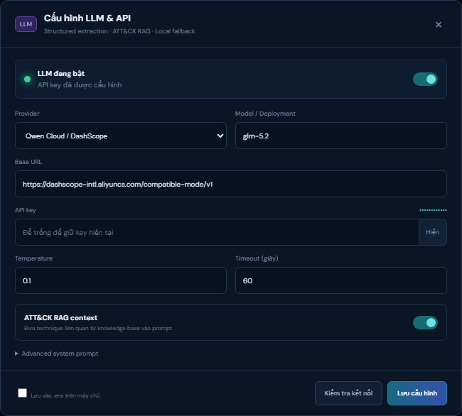
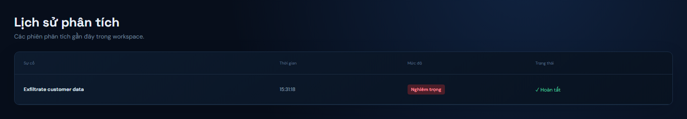

# CyberVision AI — Cybersecurity Visual Intelligence

CyberVision AI là ứng dụng Flask chuyển mô tả sự cố an ninh mạng bằng tiếng
Việt thành Structured JSON, ánh xạ MITRE ATT&CK, bổ sung bằng kho tri thức thực,
tạo sơ đồ tấn công và xuất báo cáo phía server.

Giao diện web hiện có trong `templates/` và `static/` được giữ nguyên. Backend
Flask cung cấp toàn bộ pipeline PHASE 1–5, API quản trị dữ liệu, renderer và
report generator.

## Giao diện

[](docs/images/cybervision-ui.png)

Giao diện Flask gồm khu vực nhập mô tả hoặc tải tài liệu, kết quả phân tích theo
PHASE 2–5, Structured JSON, MITRE ATT&CK mapping, attack graph, timeline và báo cáo.

### Giao diện từng phần

<table>
  <tr>
    <td width="50%" valign="top">
      <b>PHASE 1 — Input &amp; Document Parser</b><br>
      <a href="docs/images/sections/01-input-parser.png"></a>
    </td>
    <td width="50%" valign="top">
      <b>PHASE 2 — GLM-5.2 Vietnamese Understanding</b><br>
      <a href="docs/images/sections/02-phase2-llm.png"></a>
    </td>
  </tr>
  <tr>
    <td width="50%" valign="top">
      <b>PHASE 3 — Canonical Structured JSON</b><br>
      <a href="docs/images/sections/03-phase3-json.png"></a>
    </td>
    <td width="50%" valign="top">
      <b>PHASE 4 — MITRE ATT&amp;CK Semantic RAG</b><br>
      <a href="docs/images/sections/04-phase4-rag.png"></a>
    </td>
  </tr>
  <tr>
    <td width="50%" valign="top">
      <b>PHASE 5 — Graphviz / Mermaid / NetworkX</b><br>
      <a href="docs/images/sections/05-phase5-graph.png"></a>
    </td>
    <td width="50%" valign="top">
      <b>Attack Flow Diagram</b><br>
      <a href="docs/images/sections/06-attack-flow.png"></a>
    </td>
  </tr>
  <tr>
    <td width="50%" valign="top">
      <b>MITRE Tactic Timeline</b><br>
      <a href="docs/images/sections/07-timeline.png"></a>
    </td>
    <td width="50%" valign="top">
      <b>Detailed Incident Report</b><br>
      <a href="docs/images/sections/08-report.png"></a>
    </td>
  </tr>
  <tr>
    <td width="50%" valign="top">
      <b>Operations Dashboard</b><br>
      <a href="docs/images/sections/09-dashboard.png"></a>
    </td>
    <td width="50%" valign="top">
      <b>Multi-source Knowledge Base</b><br>
      <a href="docs/images/sections/10-knowledge-base.png"></a>
    </td>
  </tr>
  <tr>
    <td width="50%" valign="top">
      <b>LLM &amp; API Configuration</b><br>
      <a href="docs/images/sections/11-llm-settings.png"></a>
    </td>
    <td width="50%" valign="top">
      <b>Analysis History</b><br>
      <a href="docs/images/sections/12-history.png"></a>
    </td>
  </tr>
</table>

## Kiến trúc hiện tại

Luồng xử lý chính:

```text
Text / Email / Word / PDF / Log / Syslog / Firewall / EVTX
    ↓
PHASE 1 · Parser và chuẩn hóa UTF-8
    ↓
PHASE 2 · GLM-5.2 qua DashScope OpenAI-compatible
    ↓
PHASE 3 · Structured JSON canonical + validator
    ↓
PHASE 4 · MITRE ATT&CK semantic RAG + Knowledge Base đa nguồn
    ↓
PHASE 5 · Graphviz / Mermaid / NetworkX
    ↓
Flask UI · JSON / DOT / Mermaid / SVG / PNG / PDF / DOCX / PPTX
```

Pipeline PHASE 2–5 được điều phối bằng LangChain mặc định. Có thể đổi sang
LlamaIndex Workflows hoặc native runner bằng `PIPELINE_ORCHESTRATOR`, nhưng cả
ba chế độ đều dùng cùng một schema PHASE 3.

## Yêu cầu runtime

Thành phần tối thiểu để mở giao diện và dùng local fallback:

- Python 3.10 trở lên.
- Các package Python trong `requirements.txt`.

Pipeline mặc định đầy đủ cần thêm:

- Kết nối Alibaba Cloud Model Studio và `DASHSCOPE_API_KEY` để gọi GLM-5.2.
- Dung lượng đĩa và RAM phù hợp để tải/chạy `BAAI/bge-m3` và tạo vector index.

Thành phần theo tính năng:

- Graphviz SVG/PNG: system binary `dot`; Python package `graphviz` không thay
  thế cho binary này.
- Mermaid SVG/PNG: Node.js, `@mermaid-js/mermaid-cli` và Chrome/Chromium.
- NetworkX SVG/PNG: `networkx` và `matplotlib`, đã nằm trong
  `requirements.txt`.
- FAISS: package `faiss-cpu`, đã khai báo trong `requirements.txt`.
- Qdrant local: `qdrant-client`; Qdrant server/Cloud cần URL và API key.
- PDF: ReportLab.
- DOCX: `python-docx`.
- PPTX: Node.js và package `@oai/artifact-tool`. Package này không được bundle
  trong repository. Project tự dò Codex primary-runtime cache; deployment khác
  có thể chỉ định rõ bằng `ARTIFACT_TOOL_NODE_MODULES`.
- `.doc` legacy: bộ phụ thuộc tùy chọn trong `requirements-textract.txt` và các
  system dependency mà `textract` yêu cầu.

Kiểm tra khả năng runtime sau khi chạy web:

```text
GET /api/health
GET /api/parsers/status
GET /api/renderers/status
GET /api/orchestration/status
GET /api/report/capabilities
GET /api/rag/backends
GET /api/knowledge/status
```

Các endpoint trạng thái trả đúng khả năng hiện có. Nếu thiếu `dot`, Mermaid
CLI, Chrome hoặc artifact-tool, tính năng tương ứng được báo `ready: false`;
Graphviz và Mermaid không âm thầm đổi sang renderer khác.

## Cài đặt

Clone repository và chuyển vào thư mục project:

```powershell
git clone https://github.com/khaluc/CyberAttack-Visual-Intelligence.git
Set-Location CyberAttack-Visual-Intelligence
```

Trên Windows PowerShell:

```powershell
py -3.10 -m venv .venv
.\.venv\Scripts\Activate.ps1
python -m pip install --upgrade pip
python -m pip install -r requirements.txt
python -m pip install -r requirements-textract.txt
Copy-Item .env.example .env
```

Sau đó chỉnh `.env`, chuẩn bị model/dữ liệu và chạy:

```powershell
python scripts/download_embedding_model.py
python scripts/sync_knowledge.py all
python scripts/build_vector_index.py
python scripts/migrate_vector_backends.py qdrant faiss
python scripts/verify_vector_index.py
python scripts/run_server.py --host 127.0.0.1 --port 5000
```

Mở `http://127.0.0.1:5000`.

Các script trên đều nạp `.env` ở thư mục gốc dự án. Launcher cũng chuyển working
directory về thư mục gốc, nên các path tương đối trong cấu hình không phụ thuộc
vào vị trí PowerShell đang đứng.

Lần tải BGE-M3 và lần tạo index đầu tiên có thể mất nhiều thời gian. Không chạy
nhiều tiến trình build cùng một collection.

`scripts/run_server.py` luôn tắt reloader để không khởi tạo model/index hai lần.
Launcher đọc các giá trị sau từ `.env`; các tham số `--host`, `--port`,
`--debug` và `--no-debug` ghi đè giá trị tương ứng:

```env
CVI_HOST="127.0.0.1"
CVI_PORT="5000"
CVI_DEBUG="false"
```

Đây là local Flask server phục vụ phát triển và demo. Khi triển khai Internet,
đặt ứng dụng sau một WSGI server/reverse proxy phù hợp thay vì bật debug.

## Cấu hình GLM-5.2 qua DashScope

Không ghi API key trực tiếp vào source code. Cấu hình `.env`:

```env
LLM_ENABLED="true"
LLM_PROVIDER="dashscope"
DASHSCOPE_API_KEY="YOUR_MODEL_STUDIO_API_KEY"
LLM_API_KEY=""
LLM_BASE_URL="https://dashscope-intl.aliyuncs.com/compatible-mode/v1"
LLM_MODEL="glm-5.2"
LLM_TEMPERATURE="0.1"
LLM_TIMEOUT="60"
LLM_SYSTEM_PROMPT=""
RAG_ENABLED="true"
```

Để `LLM_SYSTEM_PROMPT` trống sẽ dùng prompt PHASE 2 tích hợp sẵn. Nếu đặt giá
trị tùy chỉnh, prompt đó phải tiếp tục yêu cầu JSON theo schema PHASE 2.

GLM-5.2 nhận system prompt chuyên gia Cyber Security, hiểu mô tả tiếng Việt và
tách từng bước với các trường:

- `step`
- `actor`
- `action`
- `target`
- `asset`
- `severity`
- `mitre_tactic`

Tactic không đủ bằng chứng được đặt thành `Unknown`. Có thể cấu hình và kiểm tra
kết nối ngay trên giao diện hoặc qua:

```text
GET  /api/config
PUT  /api/config
POST /api/config/test
```

Nếu LLM không khả dụng, pipeline ghi rõ `fallback: true`, lưu `llmError` và dùng
engine phân tích cục bộ để vẫn tạo được Structured JSON. Đây chỉ là chế độ suy
giảm của PHASE 2; không thay thế semantic embedding hoặc native graph renderer.

## PHASE 1 — Chuẩn bị dữ liệu

`POST /api/extract` nhận multipart field `file`, trích xuất nội dung và chuẩn
hóa về text UTF-8.

Định dạng hỗ trợ:

- Text, Markdown, CSV, JSON, XML.
- Email `.eml` bằng Python email parser; Outlook `.msg` qua `textract`.
- Word `.docx` bằng `python-docx`; `.doc` qua `textract` tùy chọn.
- PDF bằng PyMuPDF hoặc `pdfplumber`.
- Log, Syslog, CEF/LEEF và log Firewall.
- Windows Event `.evtx` bằng `python-evtx`.

Response gồm `filename`, `source_type`, `parser`, `characters`, `lines`,
`truncated` và `text`. Giới hạn upload Flask hiện là 10 MB.

## PHASE 2 — Hiểu tiếng Việt

`llm_service.py` gọi GLM-5.2 qua endpoint OpenAI-compatible của DashScope.
Kết quả model được bóc JSON và validate trước khi đi tiếp. PHASE 2 không tự gắn
kỹ thuật ATT&CK khi dữ liệu chưa chắc chắn; việc xác minh technique được thực
hiện ở PHASE 4.

## PHASE 3 — Structured JSON backbone

`structured_attack.py` chuẩn hóa mọi kết quả về schema canonical phiên bản
`1.0`. Diagram, timeline, knowledge evidence và báo cáo đều lấy dữ liệu từ
object này.

Các trường chính:

- `incident_id`, `incident_name`, `severity`, `confidence`, `summary`.
- `source`, `entities`, `steps`, `attack_summary`, `metadata`.
- Mỗi step có `order`, `actor`, `action`, `target`, `asset`, `severity`.
- Mapping ATT&CK nằm tại `step.mitre.tactic` và
  `step.mitre.technique_id`.
- Evidence bổ sung nằm tại `step.rag` và `step.knowledge`.

Schema API:

```text
GET  /api/schema/incident
POST /api/schema/incident/validate
```

`confidence` là điểm chất lượng pipeline có giải thích, không phải xác suất do
LLM tự khai báo. `confidence_breakdown` phản ánh độ đầy đủ cấu trúc, coverage
tactic/severity, nguồn phân tích, coverage RAG và cosine similarity.

## PHASE 4 — MITRE ATT&CK semantic RAG

Nguồn `data/mitre/enterprise-attack.json` là Enterprise ATT&CK STIX. Converter
tạo document/chunk cho technique, description, detection, mitigation và
procedure.

Embedding runtime mặc định là SentenceTransformers với model thật
`BAAI/bge-m3`:

```env
MITRE_RAG_ENABLED="true"
MITRE_STIX_PATH="./data/mitre/enterprise-attack.json"
VECTOR_DB="chroma"
VECTOR_COLLECTION="mitre_enterprise_attack"
VECTOR_INDEX_PATH="./data/vector_db"
VECTOR_AUTO_REBUILD="true"

EMBEDDING_PROVIDER="sentence-transformers"
EMBEDDING_MODEL="BAAI/bge-m3"
EMBEDDING_REVISION=""
EMBEDDING_DEVICE=""
EMBEDDING_DIMENSION="0"
EMBEDDING_BATCH_SIZE="8"
EMBEDDING_MAX_SEQ_LENGTH="512"
RAG_TOP_K="5"
```

Runtime chỉ chấp nhận semantic embedding provider; cấu hình embedding
phi ngữ nghĩa bị từ chối. Ngoài BGE-M3, adapter hỗ trợ:

- Các model SentenceTransformers như BGE Large hoặc multilingual E5/E5 Large.
  E5 tự áp dụng prefix `query:` và `passage:`.
- OpenAI/OpenAI-compatible, ví dụ `text-embedding-3-large`.
- DashScope embedding qua endpoint compatible.

Với embedding API:

```env
EMBEDDING_PROVIDER="openai"
EMBEDDING_MODEL="text-embedding-3-large"
EMBEDDING_BASE_URL="https://api.openai.com/v1"
EMBEDDING_API_KEY="YOUR_EMBEDDING_API_KEY"
```

Các vector đều được chuẩn hóa trước cosine/IP retrieval. Manifest của index lưu
backend, source hash, provider, model/revision, dimension và schema version.
Index sai model hoặc sai nguồn được đánh dấu không tương thích; khi
`VECTOR_AUTO_REBUILD=true`, retrieval sẽ build lại bằng cấu hình hiện tại.

Ba backend hoạt động thật:

- `VECTOR_DB=chroma`: ChromaDB persistent.
- `VECTOR_DB=qdrant`: Qdrant local persistent khi `QDRANT_URL` trống; dùng
  Qdrant server/Cloud khi có URL.
- `VECTOR_DB=faiss`: FAISS `IndexFlatIP` persistent cùng document metadata.

Cấu hình Qdrant server:

```env
VECTOR_DB="qdrant"
QDRANT_URL="https://YOUR-QDRANT-ENDPOINT"
QDRANT_API_KEY="YOUR_QDRANT_API_KEY"
```

Build và kiểm tra:

```powershell
python scripts/build_vector_index.py
python scripts/verify_vector_index.py
```

Sau khi Chroma hoàn tất, kích hoạt Qdrant và FAISS bằng chính embedding đã lưu,
không gọi lại BGE-M3:

```powershell
python scripts/migrate_vector_backends.py qdrant faiss
```

```text
GET  /api/rag/status
GET  /api/rag/backends
POST /api/rag/index
POST /api/rag/search
POST /api/rag/migrate
```

## Knowledge Base đa nguồn

`knowledge_base.py` quản lý registry thật bằng SQLite + FTS5. Status và số lượng
trên UI được đọc từ filesystem/index, không dùng card count mẫu.

Nguồn hỗ trợ:

- MITRE Enterprise ATT&CK STIX.
- Sigma Detection Rules YAML từ SigmaHQ.
- YARA `.yar`/`.yara` do tổ chức cung cấp và metadata tree thật của
  Yara-Rules/rules. Mặc định dùng metadata tree vì archive chứa chữ ký malware
  có thể bị endpoint protection cách ly.
- Threat Intelligence STIX/JSON/CSV, mặc định có CISA KEV.
- NIST/CIS PDF, DOCX, text hoặc HTML.
- Incident Response Playbooks; mặc định là tài liệu CISA được mirror bởi
  Western Australia Government Cyber Security Unit khi CDN CISA chặn client tự
  động.
- Enterprise Assets inventory CSV/JSON của tổ chức.

Đồng bộ toàn bộ nguồn có upstream mặc định:

```powershell
python scripts/sync_knowledge.py all
```

Đồng bộ riêng một nguồn:

```powershell
python scripts/sync_knowledge.py mitre_attack
python scripts/sync_knowledge.py sigma
python scripts/sync_knowledge.py yara
python scripts/sync_knowledge.py threat_intelligence
python scripts/sync_knowledge.py nist_cis
python scripts/sync_knowledge.py playbooks
```

Có thể lập chỉ mục lại các file đã có mà không tải lại upstream:

```powershell
python scripts/index_knowledge.py all
python scripts/index_knowledge.py sigma
```

Có thể thay URL mặc định bằng biến `KB_<SOURCE>_URLS`, ví dụ
`KB_THREAT_INTELLIGENCE_URLS`. Giá trị là danh sách URL phân tách bằng dấu
phẩy; để biến trống hoặc comment sẽ giữ manifest mặc định. Enterprise Assets
không có upstream mặc định; phải nhập dữ liệu của tổ chức. Header CSV chuẩn có sẵn tại
`examples/enterprise-assets.template.csv`; template không được tính là asset
thật trên UI.

Import asset từ CSV:

```powershell
curl.exe -X POST http://127.0.0.1:5000/api/assets/import `
  -F "file=@enterprise-assets.csv" `
  -F "mode=merge"
```

Import asset từ JSON:

```powershell
curl.exe -X POST http://127.0.0.1:5000/api/assets/import `
  -H "Content-Type: application/json" `
  --data-binary "@enterprise-assets.json"
```

`mode=merge` upsert theo asset ID; `mode=replace` chỉ thay inventory tài sản,
không xóa các nguồn knowledge khác.

API Knowledge Base:

```text
GET  /api/knowledge/status
GET  /api/knowledge/manifest
POST /api/knowledge/sync
POST /api/knowledge/index
POST /api/knowledge/search
POST /api/assets/import
GET  /api/assets
```

Sau MITRE vector retrieval, `knowledge_enrichment.py` tìm Sigma, YARA, threat
intel, NIST/CIS, playbook và asset liên quan đến từng attack step, rồi đính kèm
evidence có source, origin, metadata và score.

## LangChain và LlamaIndex orchestration

Cấu hình mặc định:

```env
PIPELINE_ORCHESTRATOR="langchain"
```

Các lựa chọn:

- `langchain`: chuỗi `RunnableLambda` có tên và trace cho từng phase.
- `llamaindex`: LlamaIndex `Workflow` với event PHASE 2 → PHASE 5.
- `native`: runner tuần tự tích hợp sẵn.

Mỗi lần phân tích lưu `engine`, `library_version`, danh sách stage và
`duration_ms` trong `structured_json.metadata.orchestration`.

## PHASE 5 — Graph Generation

`graph_generation.py` dựng một canonical directed graph với node, edge và
weight. Từ graph model đó:

- Graphviz tạo DOT và gọi system binary `dot` để render SVG/PNG.
- Mermaid tạo `flowchart LR` và gọi Mermaid CLI để render SVG/PNG.
- NetworkX tạo node-link JSON; Matplotlib render SVG/PNG.

Không có renderer SVG/PNG giả và không tự đổi engine. Nếu chọn Graphviz hoặc
Mermaid nhưng runtime thiếu, API trả lỗi rõ ràng.

API:

```text
POST /api/graph/generate
POST /api/graph/render
GET  /api/renderers/status
```

`/api/graph/render` hỗ trợ `engine=graphviz|mermaid|networkx` và
`format=svg|png|dot|mmd|json`.

### Cấu hình Graphviz

Cài Graphviz vào `PATH`, đặt portable runtime trong `.tools/graphviz`, hoặc cấu
hình chính xác:

```env
GRAPHVIZ_DOT="C:/Program Files/Graphviz/bin/dot.exe"
```

Kiểm tra:

```powershell
dot -V
```

### Cấu hình Mermaid CLI

Ví dụ cài local, không tải Chromium riêng khi máy đã có Chrome:

```powershell
$env:PUPPETEER_SKIP_DOWNLOAD="true"
npm install --prefix .tools/mermaid @mermaid-js/mermaid-cli
```

Có thể để hệ thống tự dò hoặc cấu hình:

```env
NODE_BINARY="C:/Program Files/nodejs/node.exe"
MERMAID_CLI="./.tools/mermaid/node_modules/@mermaid-js/mermaid-cli/src/cli.js"
PUPPETEER_EXECUTABLE_PATH="C:/Program Files/Google/Chrome/Application/chrome.exe"
```

## Báo cáo server-side

Các report đều nhận Structured JSON canonical:

- PDF: sinh trực tiếp bằng ReportLab.
- DOCX: sinh trực tiếp bằng `python-docx`.
- PPTX: sinh editable bằng script Node
  `scripts/generate_report_pptx.mjs` và duy nhất `@oai/artifact-tool`.

API:

```text
GET  /api/report/capabilities
POST /api/report/pdf
POST /api/report/docx
POST /api/report/pptx
```

PDF không dựa vào hộp thoại in của trình duyệt. Khi tạo hình sơ đồ nhúng,
endpoint ưu tiên NetworkX để tận dụng tỷ lệ trang rồi dùng Graphviz dự phòng;
nếu cả hai renderer đều thiếu, báo
cáo vẫn được sinh nhưng không có hình graph. Vì vậy `dot` không phải phụ thuộc
bắt buộc của PDF/DOCX.

PPTX chỉ hoạt động khi có cả Node và artifact-tool:

```env
CVI_NODE_BINARY="C:/path/to/node.exe"
ARTIFACT_TOOL_NODE_MODULES="C:/path/to/node_modules"
```

`ARTIFACT_TOOL_NODE_MODULES` phải trỏ đến thư mục chứa
`@oai/artifact-tool/package.json`. Nếu biến này để trống, service thử Codex
primary-runtime cache và các đường dẫn local đã biết. Nếu thiếu runtime,
capability PPTX là
`ready: false` và endpoint trả lỗi 503; hệ thống không tạo PPTX giả bằng thư
viện khác.

## API phân tích nhanh

Phân tích text:

```http
POST /api/analyze
Content-Type: application/json

{
  "description": "Một email giả mạo được gửi đến kế toán. Nhân viên mở file, macro chạy PowerShell tải malware, malware kết nối C2 và đánh cắp dữ liệu."
}
```

Trích xuất file:

```powershell
curl.exe -X POST http://127.0.0.1:5000/api/extract `
  -F "file=@incident.pdf"
```

## Kiểm thử

```powershell
python -m pip install -r requirements-dev.txt
python -m pytest -q
```

Test suite bao phủ Flask API, parser, Structured JSON, semantic embeddings,
Chroma/Qdrant/FAISS, Knowledge Base offline fixtures, graph generation và
report generator. Các test cần runtime ngoài sẽ kiểm tra capability hoặc skip
khi dependency tương ứng chưa được cài.

## Dữ liệu và bảo mật

- Không commit `.env` hoặc API key.
- `.tools`, model cache, vector index, knowledge source tải về, Chrome profile,
  file tạm và report output đều bị loại khỏi Git.
- Dữ liệu nguồn lớn phải được tạo lại bằng các script sync/build sau khi clone.
- Không đưa inventory thật, log sự cố hoặc tài liệu nội bộ vào repository công
  khai.
