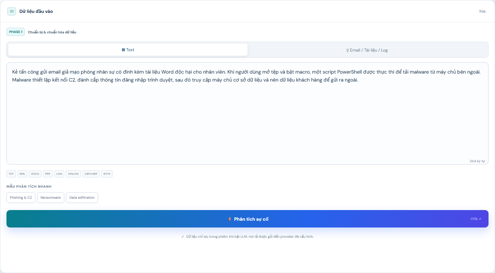
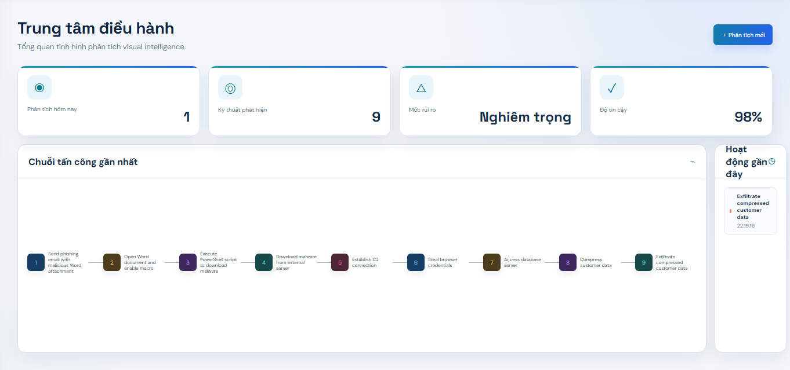
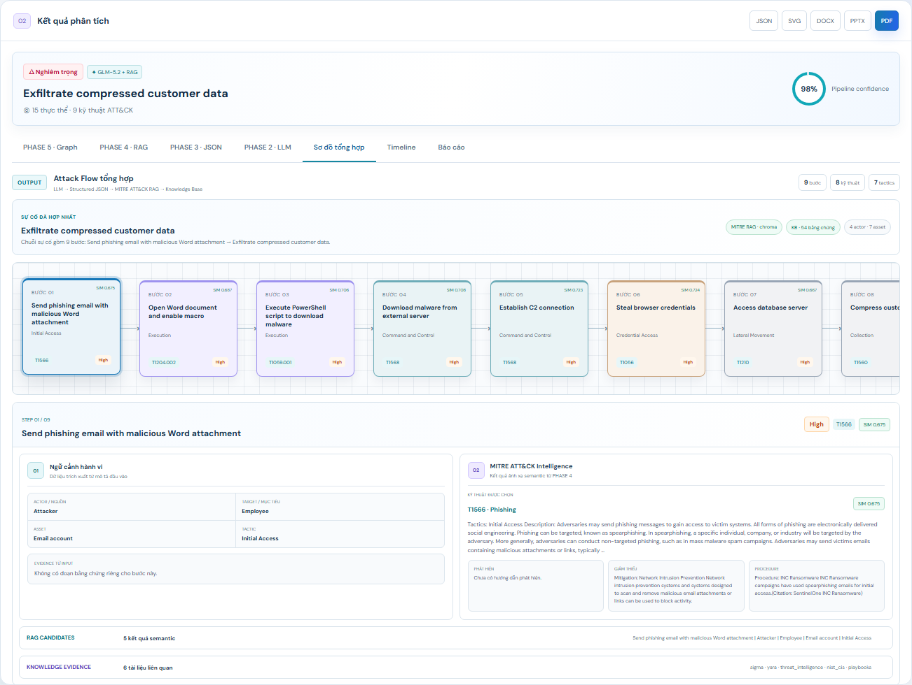
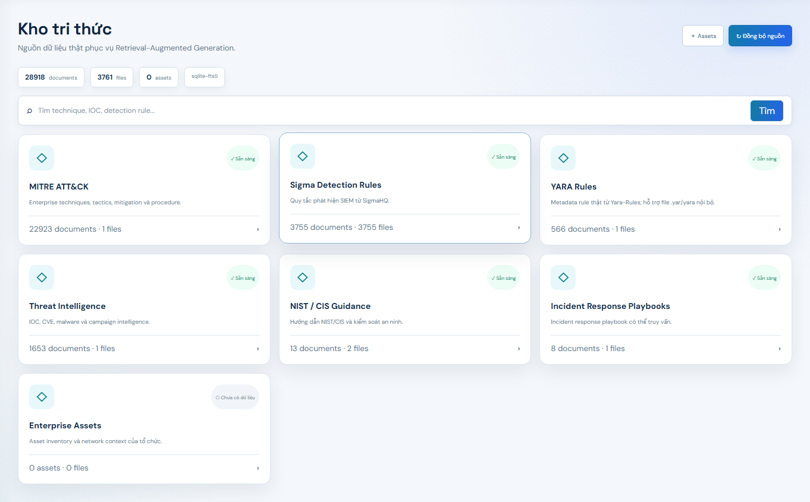
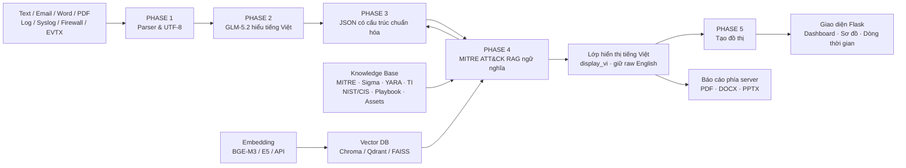

<div align="center">

# CyberVision AI

### Hệ thống Cybersecurity Visual Intelligence kết hợp LLM, RAG và Attack Diagram

CyberVision AI chuyển mô tả sự cố an ninh mạng bằng tiếng Việt thành Structured
JSON, ánh xạ MITRE ATT&CK, truy xuất bằng chứng và trực quan hóa toàn bộ chuỗi
tấn công trên một giao diện Flask.

[Demo](#demo-giao-diện) · [Kiến trúc](#kiến-trúc-hệ-thống) · [Công nghệ](#công-nghệ-sử-dụng) · [Cài đặt](#cài-đặt) · [API](#api-chính) · [Hướng phát triển](#hướng-phát-triển)

<br>


</div>

---

## Tổng quan

**CyberVision AI** là nền tảng hỗ trợ phân tích và trực quan hóa sự cố an ninh
mạng từ dữ liệu phi cấu trúc.

Hệ thống kết hợp bốn thành phần chính:

- **GLM-5.2** để hiểu mô tả tiếng Việt, nhận diện thực thể và tách chuỗi hành vi.
- **Structured JSON canonical** làm nguồn dữ liệu thống nhất cho toàn pipeline.
- **MITRE ATT&CK RAG** để xác minh kỹ thuật bằng semantic search.
- **Knowledge Base đa nguồn** để bổ sung detection, mitigation, procedure và
  bằng chứng vận hành.

CyberVision AI được xây dựng theo hướng end-to-end: từ nhập text hoặc tài liệu,
phân tích bằng LLM, ánh xạ ATT&CK, dựng graph đến xuất báo cáo phía server.
Toàn bộ workspace sử dụng giao diện sáng, responsive và nhất quán cho cả màn
hình nhập liệu, các PHASE phân tích, dashboard, sơ đồ và kho tri thức.

---

## Bài toán

Thông tin về một cuộc tấn công thường nằm rải rác trong email, báo cáo PDF,
Word, log hệ thống, Syslog, Firewall hoặc Windows Event. Dữ liệu có thể được mô
tả bằng tiếng Việt và không tuân theo một schema cố định.

Quy trình phân tích thủ công gặp nhiều khó khăn:

- Phải tách một đoạn mô tả thành từng hành vi theo đúng thứ tự.
- Phải nhận diện actor, target, asset và mức độ nghiêm trọng.
- Phải đối chiếu hành vi với tactic và technique của MITRE ATT&CK.
- Phải tìm detection rule, mitigation và procedure từ nhiều nguồn khác nhau.
- Phải chuyển kết quả kỹ thuật thành sơ đồ và báo cáo dễ sử dụng.

CyberVision AI hướng đến bốn mục tiêu:

1. Chuẩn hóa nhiều loại dữ liệu đầu vào về text UTF-8.
2. Chuyển mô tả tiếng Việt thành chuỗi bước tấn công có cấu trúc.
3. Xác minh ATT&CK mapping bằng RAG và đính kèm bằng chứng có nguồn gốc.
4. Trực quan hóa, truy vấn và xuất kết quả từ cùng một canonical JSON.

---

## Demo giao diện

<div align="center">






</div>

Demo tập trung vào bốn giao diện chính:

- **Nhập dữ liệu:** người dùng nhập mô tả tiếng Việt hoặc tải Email, Word, PDF,
  Log, Syslog, Firewall log và Windows Event.
- **Operations Dashboard:** theo dõi số lượt phân tích, kỹ thuật được phát hiện,
  mức rủi ro và chuỗi tấn công gần nhất.
- **Sơ đồ tổng hợp:** hợp nhất flow, actor, target, asset, severity, evidence,
  ATT&CK mapping, RAG candidates, detection, mitigation, procedure và bằng
  chứng Knowledge Base theo từng bước.
- **Kho tri thức:** hiển thị trạng thái và cho phép tìm kiếm MITRE ATT&CK,
  Sigma, YARA, Threat Intelligence, NIST/CIS, Playbook và Enterprise Assets.

---

## Tính năng chính

- Nhập trực tiếp mô tả sự cố bằng tiếng Việt.
- Trích xuất nội dung từ Text, Email, Word, PDF, Log, Syslog, CEF/LEEF và EVTX.
- Gọi GLM-5.2 qua DashScope OpenAI-compatible API.
- Tự động chuyển sang local fallback khi LLM không khả dụng và ghi rõ lỗi.
- Sinh Structured JSON canonical có validator và schema API.
- Semantic embedding thật bằng `BAAI/bge-m3` hoặc embedding API.
- Vector search bằng ChromaDB, Qdrant hoặc FAISS.
- Ánh xạ MITRE ATT&CK và trả về technique, description, detection, mitigation,
  procedure cùng cosine similarity.
- Giữ dữ liệu ATT&CK gốc bằng tiếng Anh cho embedding/audit và sinh song song
  `display_vi` cho giao diện, sơ đồ và báo cáo tiếng Việt.
- Truy xuất bằng chứng đa nguồn từ Sigma, YARA, Threat Intelligence, NIST/CIS,
  Playbook và Enterprise Assets.
- Điều phối PHASE 2–5 bằng LangChain, LlamaIndex Workflows hoặc native runner.
- Dựng sơ đồ bằng Graphviz, Mermaid và NetworkX.
- Hiển thị Sơ đồ tổng hợp và MITRE tactic timeline.
- Xuất JSON, DOT, Mermaid, SVG, PNG, PDF, DOCX và PPTX.
- Cấu hình LLM, API key, model, provider và system prompt ngay trên giao diện.
- Giao diện sáng responsive, hỗ trợ desktop và thiết bị di động.

---

## Kiến trúc hệ thống



Pipeline PHASE 2–5 dùng cùng một schema PHASE 3, bất kể được điều phối bằng
LangChain, LlamaIndex hay native runner.

### Luồng phân tích sự cố

```text
Mô tả hoặc tài liệu của người dùng
        ↓
Parser theo định dạng và chuẩn hóa UTF-8
        ↓
GLM-5.2 tách actor, action, target, asset, severity và tactic
        ↓
Validator tạo Structured JSON canonical
        ↓
MITRE ATT&CK RAG xác minh từng bước
        ↓
Knowledge Base bổ sung bằng chứng đa nguồn
        ↓
Lớp display_vi Việt hóa nội dung hiển thị, giữ nguyên dữ liệu gốc tiếng Anh
        ↓
Graphviz / Mermaid / NetworkX
        ↓
Operations Dashboard, Sơ đồ tổng hợp, Timeline và Báo cáo
```

### Luồng RAG và Knowledge Base

```text
Enterprise ATT&CK STIX
        ↓
Document → Chunk → Normalized Embedding
        ↓
ChromaDB / Qdrant / FAISS
        ↓
Top-K cosine similarity + domain reranking
        ↓
Technique, Description, Detection, Mitigation, Procedure
        ↓
Sigma / YARA / Threat Intelligence / NIST-CIS / Playbook / Assets
        ↓
Evidence có source, origin và metadata cho từng attack step
        ↓
Batch localization bằng GLM-5.2 → display_vi cho UI và báo cáo
```

---

## Pipeline xử lý sự cố

### PHASE 1 — Chuẩn bị dữ liệu

`POST /api/extract` nhận file upload và chuyển dữ liệu về text UTF-8.

| Dữ liệu | Parser chính |
|---|---|
| PDF | PyMuPDF, pdfplumber |
| Word `.docx` | python-docx |
| Word `.doc`, Outlook `.msg` | textract tùy chọn |
| Email `.eml` | Python email parser |
| Log, Syslog, CEF/LEEF, Firewall | Text/log parser |
| Windows Event `.evtx` | python-evtx |

### PHASE 2 — Hiểu tiếng Việt

GLM-5.2 nhận system prompt chuyên gia Cyber Security và sinh danh sách bước với
các trường:

```json
[
  {
    "step": 1,
    "actor": "Kẻ tấn công",
    "action": "Thực thi PowerShell để tải ransomware",
    "target": "Máy chủ web",
    "asset": "Máy chủ sản xuất",
    "severity": "High",
    "mitre_tactic": "Execution",
    "technique_id": "T1059.001",
    "retrieval_query_en": "execute PowerShell to download ransomware"
  }
]
```

Tactic không đủ bằng chứng được đặt thành `Unknown`. PHASE 2 không tự coi một
ATT&CK technique chưa được RAG xác minh là kết quả cuối. Các trường hiển thị
được viết bằng tiếng Việt; tactic, severity enum, technique ID và truy vấn
retrieval vẫn giữ dạng machine-readable ổn định.

### PHASE 3 — Structured JSON backbone

`structured_attack.py` chuẩn hóa kết quả thành schema canonical phiên bản
`1.0`.

```json
{
  "incident_id": "CVI-...",
  "incident_name": "Ransomware incident",
  "severity": "Critical",
  "confidence": 87,
  "display_vi": {
    "incident_name": "Sự cố ransomware qua PowerShell",
    "summary": "Kẻ tấn công sử dụng PowerShell để triển khai ransomware."
  },
  "entities": {},
  "steps": [],
  "attack_summary": {},
  "metadata": {}
}
```

Diagram, timeline, report và export đều đọc từ object này. `confidence` là điểm
chất lượng pipeline có giải thích, không phải xác suất do LLM tự khai báo.

### PHASE 4 — MITRE ATT&CK RAG

Enterprise ATT&CK STIX được chuyển thành document/chunk cho technique,
description, detection, mitigation và procedure. Mỗi attack step tạo một truy
vấn semantic độc lập và lưu:

- Technique được chọn.
- Tactic và technique ID.
- Cosine similarity dưới dạng `SIM 0.xxx`.
- Các RAG candidate thay thế.
- Detection, mitigation và procedure.
- Bằng chứng Knowledge Base liên quan.

Kho ATT&CK và kết quả semantic gốc không bị dịch trước khi embedding. Sau khi
RAG chọn Top-K, pipeline gọi GLM-5.2 một lần theo batch để tạo `display_vi` cho
technique name, description, detection, mitigation, procedure và bằng chứng đa
nguồn. Nếu bước dịch lỗi, engine deterministic vẫn sinh diễn giải tiếng Việt;
ATT&CK ID, cosine score, thứ tự candidate và raw English luôn được bảo toàn.

RAG candidate là phương án ánh xạ, không tự trở thành bước tấn công mới.

### PHASE 5 — Graph Generation

Canonical graph gồm node, edge và metadata, sau đó được chuyển thành:

- **Graphviz:** DOT và SVG/PNG qua system binary `dot`.
- **Mermaid:** `flowchart LR` và SVG/PNG qua Mermaid CLI.
- **NetworkX:** node-link JSON và SVG/PNG qua Matplotlib.

---

## Kết quả triển khai

| Thành phần | Trạng thái triển khai |
|---|---|
| Vietnamese LLM | GLM-5.2 qua DashScope OpenAI-compatible |
| Local fallback | Có, được đánh dấu rõ trong response và UI |
| Structured schema | Canonical JSON v1.0 + validator |
| Embedding mặc định | `BAAI/bge-m3`, vector được normalized |
| Vector backend | ChromaDB, Qdrant và FAISS |
| ATT&CK source | Enterprise ATT&CK STIX |
| Ngôn ngữ đầu ra | `display_vi` qua GLM-5.2 + deterministic fallback |
| Knowledge Base | SQLite + FTS5, dữ liệu đa nguồn thật |
| Orchestration | LangChain, LlamaIndex hoặc native |
| Graph renderer | Graphviz, Mermaid và NetworkX |
| Server report | PDF, DOCX và PPTX |
| UI output | Dashboard, Sơ đồ tổng hợp, Timeline, Report |

Hệ thống không âm thầm thay Graphviz hoặc Mermaid bằng renderer khác. Nếu thiếu
runtime native, capability endpoint trả `ready: false` và API báo lỗi cụ thể.

---

## Thiết kế LLM và độ tin cậy

GLM-5.2 được gọi qua endpoint OpenAI-compatible:

```text
https://dashscope-intl.aliyuncs.com/compatible-mode/v1
```

Kết quả từ model được bóc JSON, chuẩn hóa và validate trước khi đi sang RAG.
Khi LLM lỗi, pipeline dùng local extraction engine nhưng vẫn giữ Structured
JSON cùng metadata `fallback` và `llmError`.

Điểm `confidence` được tính từ:

- Độ đầy đủ của cấu trúc.
- Coverage của tactic và severity.
- Nguồn phân tích LLM hay local fallback.
- Coverage ATT&CK RAG.
- Cosine similarity trung bình.

Cosine similarity chỉ thể hiện mức gần nhau giữa embedding truy vấn và tài liệu,
không được hiển thị như xác suất tuyệt đối.

---

## Công nghệ sử dụng

### AI, RAG và dữ liệu

| Thành phần | Công nghệ |
|---|---|
| LLM mặc định | GLM-5.2 |
| LLM API | DashScope OpenAI-compatible |
| Embedding | BGE-M3, BGE Large, multilingual E5 hoặc embedding API |
| ATT&CK data | Enterprise ATT&CK STIX |
| Vector search | ChromaDB, Qdrant, FAISS |
| Knowledge search | SQLite, FTS5 |
| Detection content | Sigma, YARA |
| Threat intelligence | STIX, JSON, CSV, CISA KEV |
| Guidance | NIST/CIS, Incident Response Playbook |
| Orchestration | LangChain, LlamaIndex Workflows |

### Backend

| Thành phần | Công nghệ |
|---|---|
| Ngôn ngữ | Python 3.10+ |
| Framework | Flask 3 |
| Document parser | PyMuPDF, pdfplumber, python-docx, textract, python-evtx |
| Graph model | NetworkX |
| Graph renderer | Graphviz, Mermaid CLI, Matplotlib |
| PDF | ReportLab |
| DOCX | python-docx |
| PPTX | `@oai/artifact-tool` |
| Test | pytest |

### Frontend

| Thành phần | Công nghệ |
|---|---|
| Giao diện | HTML5 |
| Logic | Vanilla JavaScript |
| Styling | Responsive CSS |
| API transport | Fetch API |
| Biểu diễn flow | DOM/CSS + native graph preview |

---

## Cấu trúc dự án

```text
CyberAttack-Visual-Intelligence/
├── app.py                         # Flask routes và API
├── analysis_engine.py             # Local fallback engine
├── config_store.py                # Cấu hình LLM/API an toàn
├── document_parser.py             # PHASE 1 document parsing
├── llm_service.py                 # PHASE 2 GLM-5.2 integration
├── structured_attack.py           # PHASE 3 canonical schema
├── mitre_rag.py                   # PHASE 4 ATT&CK RAG
├── vector_backends.py             # Embedding + Chroma/Qdrant/FAISS
├── vector_management.py           # Quản trị và migration vector index
├── knowledge_base.py              # Registry, sync và FTS5 search
├── knowledge_enrichment.py        # Evidence theo từng attack step
├── pipeline_orchestrator.py       # LangChain/LlamaIndex/native pipeline
├── graph_generation.py            # PHASE 5 graph generation
├── report_generator.py            # PDF/DOCX/PPTX reports
├── templates/
│   └── index.html
├── static/
│   ├── app.js
│   ├── styles.css
│   ├── diagram.css
│   └── phase*.css
├── scripts/
│   ├── run_server.py
│   ├── sync_knowledge.py
│   ├── index_knowledge.py
│   ├── build_vector_index.py
│   ├── migrate_vector_backends.py
│   └── verify_vector_index.py
├── docs/images/sections/          # Ảnh demo giao diện
├── examples/                      # Enterprise Assets template
├── tests/                         # Unit và integration tests
├── requirements.txt
├── requirements-dev.txt
├── requirements-textract.txt
├── .env.example
└── README.md
```

---

## Yêu cầu hệ thống

Thành phần tối thiểu:

- Python 3.10 trở lên.
- Các package trong `requirements.txt`.
- RAM tối thiểu 8 GB để chạy giao diện và local fallback.

Pipeline đầy đủ được khuyến nghị:

- RAM từ 16 GB khi dùng BGE-M3 và vector index cục bộ.
- Alibaba Cloud Model Studio API key để gọi GLM-5.2.
- Dung lượng đĩa phù hợp cho embedding model, ATT&CK STIX và Knowledge Base.

Thành phần tùy chọn theo tính năng:

- Graphviz system binary `dot` cho Graphviz SVG/PNG.
- Node.js, Mermaid CLI và Chrome/Chromium cho Mermaid SVG/PNG.
- Node.js cùng `@oai/artifact-tool` cho PPTX.
- Các system dependency của `textract` nếu cần đọc `.doc` hoặc `.msg`.

---

## Cài đặt

### 1. Clone repository

```powershell
git clone https://github.com/khaluc/CyberAttack-Visual-Intelligence.git
Set-Location CyberAttack-Visual-Intelligence
```

### 2. Tạo môi trường Python

```powershell
py -3.10 -m venv .venv
.\.venv\Scripts\Activate.ps1
python -m pip install --upgrade pip
```

Linux hoặc macOS:

```bash
python3 -m venv .venv
source .venv/bin/activate
python -m pip install --upgrade pip
```

### 3. Cài đặt dependencies

```powershell
python -m pip install -r requirements.txt
python -m pip install -r requirements-dev.txt
```

Nếu cần đọc định dạng `.doc` hoặc `.msg`:

```powershell
python -m pip install -r requirements-textract.txt
```

### 4. Cấu hình môi trường

```powershell
Copy-Item .env.example .env
```

Cấu hình GLM-5.2 trong `.env`:

```env
LLM_ENABLED="true"
LLM_PROVIDER="dashscope"
DASHSCOPE_API_KEY="YOUR_MODEL_STUDIO_API_KEY"
LLM_BASE_URL="https://dashscope-intl.aliyuncs.com/compatible-mode/v1"
LLM_MODEL="glm-5.2"
LLM_TEMPERATURE="0.1"
LLM_TIMEOUT="60"
RAG_ENABLED="true"
RAG_LOCALIZATION_ENABLED="true"
```

Không commit `.env` hoặc API key lên GitHub.

### 5. Chuẩn bị embedding và dữ liệu

```powershell
python scripts/download_embedding_model.py
python scripts/sync_knowledge.py all
python scripts/build_vector_index.py
python scripts/verify_vector_index.py
```

Kích hoạt thêm Qdrant và FAISS từ index đã tạo:

```powershell
python scripts/migrate_vector_backends.py qdrant faiss
```

Lần tải BGE-M3 và build index đầu tiên có thể mất nhiều thời gian. Không chạy
nhiều tiến trình build cùng một collection.

### 6. Chạy Flask

```powershell
python scripts/run_server.py --host 127.0.0.1 --port 5000
```

Mở:

```text
http://127.0.0.1:5000
```

Launcher luôn tắt Flask reloader để tránh khởi tạo model hoặc vector index hai
lần.

### 7. Kiểm tra runtime

```text
GET /api/health
GET /api/parsers/status
GET /api/renderers/status
GET /api/orchestration/status
GET /api/report/capabilities
GET /api/rag/backends
GET /api/knowledge/status
```

---

## Cấu hình RAG và orchestration

Cấu hình mặc định:

```env
MITRE_RAG_ENABLED="true"
MITRE_STIX_PATH="./data/mitre/enterprise-attack.json"
VECTOR_DB="chroma"
VECTOR_COLLECTION="mitre_enterprise_attack"
VECTOR_INDEX_PATH="./data/vector_db"
VECTOR_AUTO_REBUILD="true"

EMBEDDING_PROVIDER="sentence-transformers"
EMBEDDING_MODEL="BAAI/bge-m3"
EMBEDDING_BATCH_SIZE="8"
EMBEDDING_MAX_SEQ_LENGTH="512"
RAG_TOP_K="5"
RAG_LOCALIZATION_ENABLED="true"

PIPELINE_ORCHESTRATOR="langchain"
```

Các lựa chọn `VECTOR_DB`:

- `chroma`: ChromaDB persistent.
- `qdrant`: Qdrant local hoặc Qdrant server/Cloud.
- `faiss`: FAISS `IndexFlatIP` persistent.

Các lựa chọn `PIPELINE_ORCHESTRATOR`:

- `langchain`: chuỗi `RunnableLambda` có trace theo phase.
- `llamaindex`: workflow event PHASE 2 → PHASE 5.
- `native`: runner tuần tự tích hợp sẵn.

---

## Đồng bộ Knowledge Base

Đồng bộ toàn bộ nguồn mặc định:

```powershell
python scripts/sync_knowledge.py all
```

Đồng bộ hoặc lập chỉ mục từng nguồn:

```powershell
python scripts/sync_knowledge.py mitre_attack
python scripts/sync_knowledge.py sigma
python scripts/sync_knowledge.py yara
python scripts/sync_knowledge.py threat_intelligence
python scripts/sync_knowledge.py nist_cis
python scripts/sync_knowledge.py playbooks

python scripts/index_knowledge.py all
```

Enterprise Assets không có upstream mặc định vì đây là dữ liệu riêng của tổ
chức. Template CSV nằm tại:

```text
examples/enterprise-assets.template.csv
```

---

## API chính

| Nhóm | Endpoint | Chức năng |
|---|---|---|
| Analysis | `POST /api/analyze` | Phân tích mô tả và chạy toàn pipeline |
| Parser | `POST /api/extract` | Trích xuất text từ tài liệu |
| Parser | `GET /api/parsers/status` | Kiểm tra parser runtime |
| Schema | `GET /api/schema/incident` | Lấy canonical JSON schema |
| Schema | `POST /api/schema/incident/validate` | Validate incident JSON |
| RAG | `GET /api/rag/status` | Trạng thái ATT&CK vector index |
| RAG | `POST /api/rag/search` | Semantic search ATT&CK |
| RAG | `POST /api/rag/index` | Build lại vector index |
| RAG | `POST /api/rag/migrate` | Migrate vector backend |
| Knowledge | `GET /api/knowledge/status` | Trạng thái kho tri thức |
| Knowledge | `POST /api/knowledge/search` | Tìm kiếm đa nguồn |
| Knowledge | `POST /api/knowledge/sync` | Đồng bộ upstream |
| Assets | `POST /api/assets/import` | Import Enterprise Assets |
| Graph | `POST /api/graph/generate` | Sinh graph source/model |
| Graph | `POST /api/graph/render` | Render SVG/PNG/source |
| Report | `POST /api/report/pdf` | Sinh báo cáo PDF |
| Report | `POST /api/report/docx` | Sinh báo cáo DOCX |
| Report | `POST /api/report/pptx` | Sinh báo cáo PPTX |
| Config | `GET /api/config` | Đọc cấu hình đã che API key |
| Config | `PUT /api/config` | Cập nhật LLM/API |
| Config | `POST /api/config/test` | Kiểm tra kết nối provider |

Ví dụ phân tích:

```http
POST /api/analyze
Content-Type: application/json

{
  "description": "Máy chủ web bị khai thác lỗ hổng. Kẻ tấn công chạy PowerShell tải ransomware, mã hóa dữ liệu và xóa bản sao lưu."
}
```

---

## Kiểm thử

```powershell
python -m pip install -r requirements-dev.txt
python -m pytest -q
```

Kiểm tra bootstrap và Sơ đồ tổng hợp bằng Node.js:

```powershell
node tests/ui_bootstrap_smoke.mjs
node tests/ui_diagram_smoke.mjs
```

Test suite bao phủ:

- Flask API và cấu hình.
- Document parser.
- Structured JSON validator.
- Semantic embedding và Chroma/Qdrant/FAISS.
- Knowledge Base offline fixtures.
- LangChain/LlamaIndex/native orchestration.
- Graph generation.
- PDF, DOCX và PPTX report generator.
- Frontend bootstrap và Sơ đồ tổng hợp.

---

## Điểm nổi bật kỹ thuật

- Một canonical JSON làm single source of truth cho toàn bộ output.
- LLM extraction và ATT&CK mapping được tách thành hai phase độc lập.
- Semantic embedding thật, không sử dụng HashingVectorizer trong runtime.
- Ba vector backend dùng cùng normalized embedding.
- Knowledge Base đa nguồn có provenance thay vì số liệu card mẫu.
- Sơ đồ tổng hợp liên kết hành vi, ATT&CK intelligence và bằng chứng vận hành.
- Cosine similarity được trình bày đúng bản chất, không gọi là xác suất.
- Graphviz và Mermaid dùng native renderer thật.
- Báo cáo PDF/DOCX/PPTX được sinh phía server.
- Pipeline có local fallback, capability checks và orchestration trace.

---

## Hạn chế hiện tại

- Tải BGE-M3 và build vector index lần đầu cần nhiều thời gian, RAM và dung
  lượng đĩa.
- Chất lượng ánh xạ phụ thuộc vào độ rõ của mô tả và dữ liệu ATT&CK hiện có.
- Knowledge Base upstream có thể thay đổi URL hoặc giới hạn client tự động.
- Enterprise Assets phải do tổ chức tự nhập và không nên đưa vào repository
  công khai.
- Flask launcher hiện phù hợp cho phát triển và demo; production cần WSGI
  server, reverse proxy và hardening.
- Chưa có authentication, RBAC và lưu lịch sử phân tích vào cơ sở dữ liệu lâu
  dài.

---

## Hướng phát triển

- [ ] Docker hóa Flask, vector backend và renderer runtime.
- [ ] Bổ sung CI/CD và kiểm thử browser tự động trên pull request.
- [ ] Thêm authentication, RBAC và audit log.
- [ ] Lưu lịch sử phân tích vào cơ sở dữ liệu.
- [ ] Thêm job queue cho sync Knowledge Base, embedding và report generation.
- [ ] Hỗ trợ TAXII/STIX feed và IOC correlation theo thời gian thực.
- [ ] Tích hợp SIEM, SOAR, EDR và ticketing system.
- [ ] Thêm RAG-assisted step refinement có provenance rõ ràng.
- [ ] Bổ sung analyst feedback để xác nhận hoặc sửa ATT&CK mapping.
- [ ] Triển khai production bằng WSGI server và reverse proxy.

---

## Bảo mật dữ liệu

- Không commit `.env`, API key hoặc credential.
- Không đưa inventory thật, log sự cố hoặc tài liệu nội bộ vào repository công
  khai.
- Model cache, vector index, dữ liệu Knowledge Base, file tạm và report output
  được loại khỏi Git.
- Khi bật LLM cloud, mô tả sự cố sẽ được gửi đến provider đã cấu hình.
- Chỉ import dữ liệu tổ chức sau khi đã phân loại và áp dụng chính sách lưu trữ
  phù hợp.

---

## Tác giả

Repository được phát triển và duy trì tại:

- GitHub: [@khaluc](https://github.com/khaluc)
- Project: [CyberAttack-Visual-Intelligence](https://github.com/khaluc/CyberAttack-Visual-Intelligence)

---

<div align="center">

Được xây dựng bằng **Python, Flask, GLM-5.2, BGE-M3, MITRE ATT&CK, RAG và
Knowledge Base đa nguồn**.

Nếu dự án hữu ích, hãy để lại một ⭐ để ủng hộ.

</div>
